<div align="center">

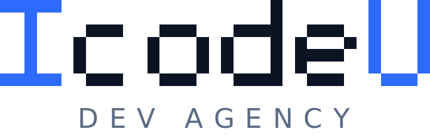

# 🖥️ SevMerge — IT 외주 역제안 입찰 플랫폼

**의뢰인이 프로젝트를 등록하면, 전문가들이 먼저 제안서를 제출해 경쟁하는 역(逆)제안 입찰 방식의 프리랜서 매칭 플랫폼**

안전한 거래를 위한 **에스크로 결제**, **실시간 채팅·알림**, **AI 의뢰 작성 도우미**까지 갖춘 풀스택 웹 서비스

<br/>


</div>

<br/>

## 🚀 프로젝트 개요

| 항목 | 내용 |
|------|------|
| 프로젝트 유형 | 개인 프로젝트 (백엔드 중심 풀스택) |
| 개발 기간 | 2026.05 ~ 2026.06 (약 4주) |
| 핵심 가치 | 역제안 입찰 · 에스크로 안전거래 · 실시간 소통 · AI 작성 보조 |
| 아키텍처 | Spring Boot 모놀리식 + Mustache 서버사이드 렌더링(SSR) |
| Repository | https://github.com/bin1998-git/SevMerge |

<br/>

## 🔍 해결하고자 하는 문제

기존 외주 플랫폼에서는 다음과 같은 문제가 발생합니다.

- 의뢰인이 수많은 전문가를 직접 탐색·연락해야 하는 **비효율적 매칭 구조**
- 선불 결제 후 작업 미완료 시 환불이 어려운 **거래 신뢰 문제**
- 신규 전문가의 실력 파악이 어려운 **정보 비대칭 문제**

**SevMerge** 는 이 흐름을 뒤집어, 의뢰인이 프로젝트만 올리면 전문가들이 제안서를 들고 경쟁하는 **역제안(reverse-bidding)** 구조와, 플랫폼이 대금을 보관했다가 작업 완료 시 정산하는 **에스크로** 로 위 문제를 해결합니다.

<br/>

## 🎮 기술 스택

### ✨ Back-End

<details>
<summary>⚡️ BE 자세히 살펴보기</summary>
<br/>
<ul>
<li>Java : 21 (Toolchain)</li>
<li>Spring Boot : 3.4.5</li>
<li>Spring Data JPA / Hibernate</li>
<li>Spring Security (BCrypt, CSRF, Session)</li>
<li>Spring WebSocket (STOMP)</li>
<li>Spring AI : 1.1.1 (Google GenAI)</li>
<li>Mustache (SSR)</li>
<li>MySQL : 8.0</li>
<li>Lombok / Validation / Gradle</li>
</ul>
</details>

### 💻 Front-End

<details>
<summary>⚡️ FE 자세히 살펴보기</summary>
<br/>
<ul>
<li>Mustache (Server-Side Rendering)</li>
<li>HTML5 / CSS3 / Vanilla JavaScript</li>
<li>Chart.js : 4.4.1 (관리자 통계)</li>
<li>WebSocket / SSE (실시간 UI)</li>
</ul>
</details>

### 🛠 외부 API

<details>
<summary>⚡️ API 자세히 살펴보기</summary>
<br/>
<ul>
<li>Toss Payments API (서버 사이드 결제 승인)</li>
<li>Kakao / Google 소셜 로그인 (OAuth 2.0)</li>
<li>Google Gemini 2.5 Flash (Spring AI)</li>
<li>SolAPI (SMS · 알림톡)</li>
<li>Gmail SMTP (이메일 인증)</li>
</ul>
</details>

### 🙌🏻 Tools

      <br/>   

<br/>

## ⚙ 의존성

```gradle
implementation 'org.springframework.boot:spring-boot-starter-web'
implementation 'org.springframework.boot:spring-boot-starter-data-jpa'
implementation 'org.springframework.boot:spring-boot-starter-mustache'
implementation 'org.springframework.boot:spring-boot-starter-validation'
implementation 'org.springframework.boot:spring-boot-starter-security'
implementation 'org.springframework.security:spring-security-crypto'
implementation 'org.springframework.boot:spring-boot-starter-websocket'
implementation 'org.springframework.boot:spring-boot-starter-mail'
implementation 'org.springframework.ai:spring-ai-starter-model-google-genai'
implementation 'com.solapi:sdk:1.0.3'
implementation 'org.webjars.npm:chart.js:4.4.1'
implementation 'org.webjars:webjars-locator-core'
runtimeOnly 'com.mysql:mysql-connector-j'
compileOnly 'org.projectlombok:lombok'
```

<br/>
## 1️⃣ 프로젝트 구조

<details>
<summary>⚡️ 구조 자세히 살펴보기</summary>

```
src/main/java/com/example/SevMerge
├── member              # 회원, 로그인, OAuth(Kakao/Google), 이메일/SMS 인증, 마이페이지
├── expertprofile       # 전문가 프로필, 등급 산정(베이지안), 인증 전문가
├── expertwish/bookmark # 전문가 찜, 북마크
├── project             # 프로젝트(의뢰) 등록·검색·상태 관리
├── bid / adbid         # 제안서(입찰), 수신 필터, 낙찰, 광고 입찰
├── payment             # 에스크로 생성·정산·환불
├── charge / refund     # Toss 잔액 충전, 환불 신청·심사
├── withdrawal/revenue  # 전문가 정산금 출금, 매출 집계
├── review / portfolio  # 리뷰·별점, 전문가 포트폴리오
├── deliverable         # 산출물 제출
├── board / comment     # 게시판, 댓글
├── chatRoom/chatMessage# WebSocket(STOMP) 실시간 채팅
├── message             # 쪽지(첨부파일)
├── notification        # SSE 실시간 알림 + 정리 스케줄러
├── ai                  # Spring AI(Gemini) 의뢰 작성·Q&A
├── advertisement       # 광고 슬롯
├── partnership/faq/footer # 제휴 문의, FAQ, 정책/약관
├── Report / admin      # 신고·블랙리스트, 관리자 페이지
└── core                # config / interceptor / filter / exception / util
```

</details>

<br/>

## 2️⃣ 프로젝트 주제

- 실무 활용도가 높은 **결제·정산·외부 API** 가 결합된 도메인 중 **IT 외주 매칭** 을 선정
- 단순 매칭이 아닌 **역제안 입찰(reverse-bidding)** 구조로 차별화
- 거래 신뢰 문제를 **에스크로** 로 해결

<br/>

## 3️⃣ 기능 구분

#### 🙋 의뢰인 (Client)
- 프로젝트 등록(AI 작성 보조), 제안서 비교·낙찰, 에스크로 결제·정산
- 잔액 충전(Toss), 환불 신청, 리뷰 작성, 실시간 채팅·알림·쪽지

#### 🧑‍💻 전문가 (Expert)
- 관리자 심사를 거친 인증 전문가 활동, 베이지안 등급 산정
- 프로젝트 탐색·제안서 제출, 포트폴리오, 정산금 출금, 광고 입찰

#### 🛡 관리자 (Admin)
- 대시보드(Chart.js 통계), 전문가 심사·승인, 회원·신고·환불·광고·공지 관리

<br/>

## 4️⃣ ERD & 도메인 모델


<br/>

| 엔티티 | 설명 | 핵심 상태/필드 |
|--------|------|----------------|
| Member | 회원 | `role`(CLIENT/EXPERT/ADMIN), `status`(ACTIVE/PENDING/REJECTED/SUSPENDED/BLACKLISTED), `balance` |
| ExpertProfile | 전문가 프로필 | `isCertified`, `grade`(NORMAL/SKILLED/MASTER) |
| Project | 의뢰 | `status`(OPEN/IN_PROGRESS/DONE/CANCELLED…), `category`, `bidFilter` |
| Bid | 제안서 | `status`(PENDING/SELECTED/HOLD/REJECTED), 제안 금액/기간 |
| Payment | 에스크로 | `status`(PAID/SETTLED/REFUNDED), `platformFee`, `netAmount` |
| Review / Notification | 리뷰 / 알림 | 별점, 읽음 여부(30일 후 자동 정리) |
| Report / BlackList | 신고/제재 | 누적 3회 자동 정지 |

<br/>

## 5️⃣ 핵심 플로우

#### 역제안 입찰 + 에스크로 흐름

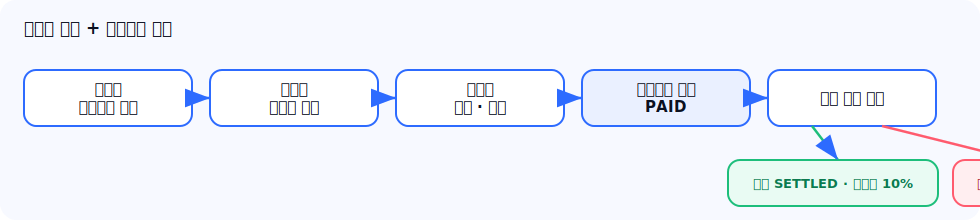

#### 상태 머신 (Bid / Payment)

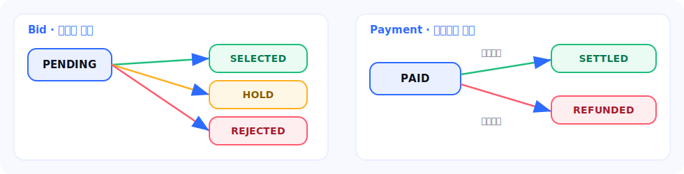

<br/>
## 6️⃣ 주요 기능 (핵심 시연)

> 아래 GIF는 **Playwright E2E 시나리오 녹화본** 을 기능 단위로 짧게 잘라낸 실제 동작 화면입니다.

<table>
<tr>
  <td align="center"><b>프로젝트 탐색</b></td>
  <td align="center"><b>제안서 제출 (역제안 입찰)</b></td>
</tr>
<tr>
  <td>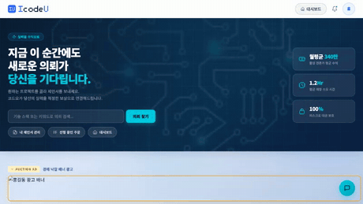</td>
  <td>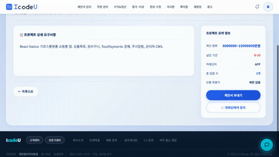</td>
</tr>
<tr>
  <td align="center"><b>잔액 충전 (Toss)</b></td>
  <td align="center"><b>에스크로 결제 내역</b></td>
</tr>
<tr>
  <td>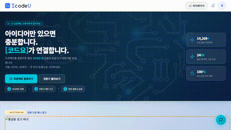</td>
  <td>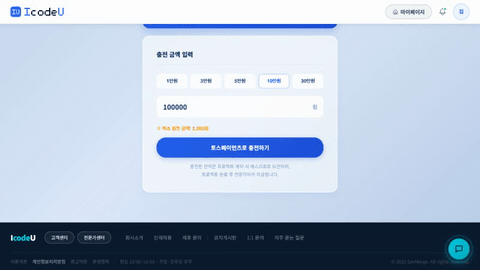</td>
</tr>
</table>

<br/>

## 7️⃣ 기능 — 의뢰인 (Client)

<table>
<tr>
  <td align="center"><b>마이페이지</b></td>
  <td align="center"><b>실시간 알림</b></td>
  <td align="center"><b>쪽지 (첨부파일)</b></td>
</tr>
<tr>
  <td>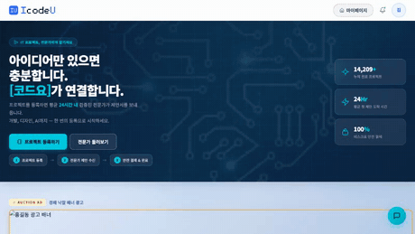</td>
  <td>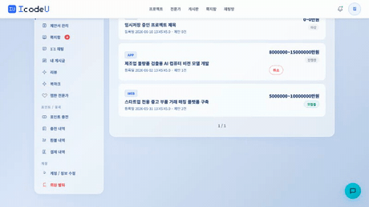</td>
  <td>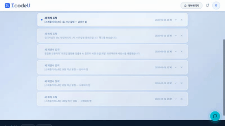</td>
</tr>
</table>

<br/>

## 8️⃣ 기능 — 전문가 (Expert)

<table>
<tr>
  <td align="center"><b>전문가 대시보드</b></td>
  <td align="center"><b>마이페이지 (등급·평점)</b></td>
</tr>
<tr>
  <td>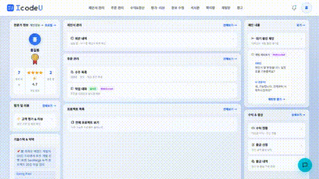</td>
  <td>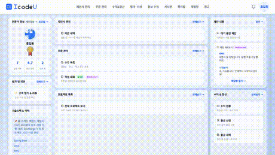</td>
</tr>
<tr>
  <td align="center"><b>실시간 채팅 (WebSocket)</b></td>
  <td align="center"><b>실시간 알림</b></td>
</tr>
<tr>
  <td>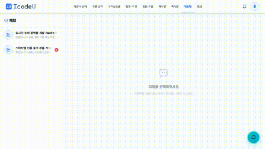</td>
  <td>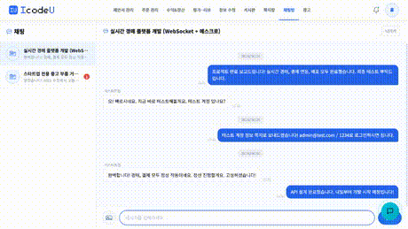</td>
</tr>
<tr>
  <td align="center"><b>쪽지 (첨부파일)</b></td>
  <td align="center"><b>정산금 출금</b></td>
</tr>
<tr>
  <td>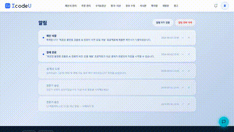</td>
  <td>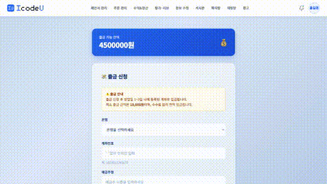</td>
</tr>
<tr>
  <td align="center" colspan="2"><b>게시판 · 후기</b></td>
</tr>
<tr>
  <td align="center" colspan="2">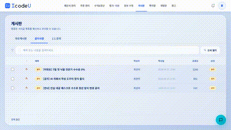</td>
</tr>
</table>

<br/>

## 9️⃣ 기능 — 관리자 (Admin)

- 전문가 심사·승인 (승인 시 인증 전문가 부여), 회원·신고·블랙리스트(누적 3회 자동 정지) 관리
- 환불 분쟁 처리, 광고·제휴·공지·FAQ 관리
- 대시보드 통계 (Chart.js) — 월별 매출 추이, 카테고리별 프로젝트, 전문가 등급 비율 등

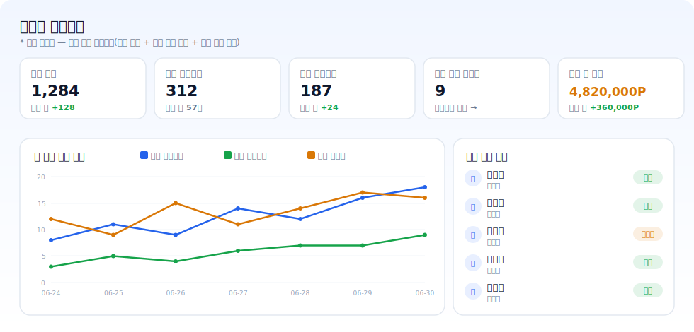

<br/>
## 🧩 기술적 하이라이트

### 1. 에스크로 — 동시성을 고려한 원자적 잔액 처리
낙찰 시 의뢰인 잔액을 에스크로로 묶을 때, 조건부 `UPDATE` 한 방으로 잔액 검증과 차감을 원자적으로 처리해 동시 요청에서의 이중 차감을 방지합니다.

```java
// PaymentService.createEscrow — 잔액이 충분할 때만 차감되는 원자적 UPDATE
int updated = em.createQuery(
    "UPDATE Member m SET m.balance = m.balance - :amount " +
    "WHERE m.id = :id AND m.balance >= :amount")
    .setParameter("amount", amount)
    .setParameter("id", clientId)
    .executeUpdate();

if (updated == 0) throw new BadRequestException("잔액 차감에 실패했습니다.");
```

### 2. 결제 보안 — 서버 사이드 Toss 승인
클라이언트가 아닌 서버에서 Toss confirm API를 직접 호출해 결제 금액 위변조를 방지합니다.

### 3. 전문가 등급 — 베이지안 평균으로 별점 왜곡 보정
리뷰가 적은 신규 전문가의 별점 왜곡을 완화하기 위해 전체 평균을 사전(prior)으로 활용하는 베이지안 평균을 적용합니다.

### 4. 다단 인터셉터 기반 인가 + Rate Limiting
Session / Login / Admin / Project / Bid 5종 인터셉터와 RateLimitFilter를 계층적으로 적용해 권한과 요청 빈도를 제어합니다.

### 5. 알림·외부연동의 트랜잭션 분리
SMS·이메일·SSE 알림 등 외부 연동을 트랜잭션 커밋 이후에 실행해 롤백 시 불필요한 외부 호출을 방지합니다.

<br/>

## 🔗 URL 매핑

<details>
<summary>주요 엔드포인트 보기</summary>

| Method | URL | 설명 | 권한 |
|--------|-----|------|------|
| GET | `/` | 메인 페이지 | 비로그인 |
| GET/POST | `/members/login` · `/members/join` | 로그인 / 회원가입 | 비로그인 |
| GET | `/projects` · `/projects/{id}` | 프로젝트 목록 / 상세 | 로그인 |
| GET/POST | `/projects/new` | 프로젝트 등록 | 의뢰인 |
| POST | `/api/v1/bids` · `/bids/{id}/select` | 제안서 제출 / 낙찰 | 전문가 / 의뢰인 |
| POST | `/api/v1/payments/escrow` · `/{id}/settle` | 에스크로 생성 / 정산 | 의뢰인 |
| POST | `/api/v1/charges` · `/refunds` · `/withdrawals` | 충전 / 환불 / 출금 | 로그인 |
| POST | `/api/v1/project/ai/draft` · `/ask` | AI 초안 / Q&A | 의뢰인 / 로그인 |
| GET | `/chats/{roomId}` · `/api/v1/notifications` | 채팅방 / 알림(SSE) | 로그인 |
| GET | `/admin` · `/admin/experts/pending` | 관리자 대시보드 / 전문가 심사 | 관리자 |

</details>

<br/>

## ⚙️ 실행 방법

```bash
git clone https://github.com/bin1998-git/SevMerge.git
cd SevMerge

# MySQL DB 생성
# CREATE DATABASE sevmerge DEFAULT CHARACTER SET utf8mb4;

# .env 작성 후 실행 (JDK 21+, MySQL 8.0+)
./gradlew bootRun          # Windows: gradlew.bat bootRun
```

`.env` 예시

```env
DB_USERNAME=root
DB_PASSWORD=
GOOGLE_CLIENT_ID=        GOOGLE_CLIENT_SECRET=
KAKAO_CLIENT_ID=         KAKAO_CLIENT_SECRET=
TOSS_CLIENT_KEY=         TOSS_SECRET_KEY=
MAIL_USERNAME=           MAIL_PASSWORD=
SOLAPI_KEY=              SOLAPI_SECRET_KEY=     SOLAPI_SENDER_NUMBER=
GEMINI_API_KEY=
```

> 실행 후 http://localhost:8080 접속 (초기 구동 시 `db/data.sql` 시드 데이터 자동 적재)

<br/>

## 🌿 커밋 컨벤션

`<타입>(<스코프>): <제목>` — `feat` 새 기능 · `fix` 버그 · `refactor` 리팩터링 · `docs` 문서 · `style` 스타일 · `test` 테스트 · `chore` 빌드/기타

<div align="center">
<br/>

**SevMerge** © 2026

</div>
