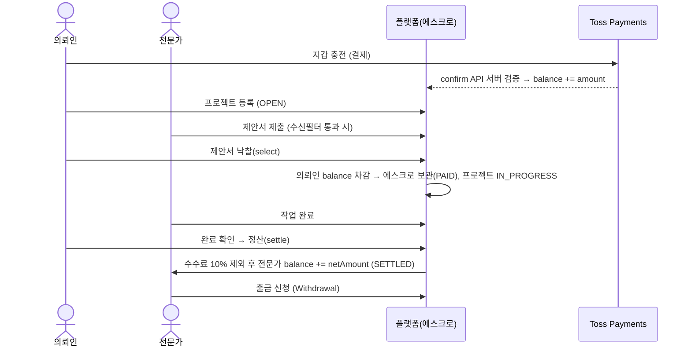

# 🖥️ SevMerge — IT 외주 역제안 입찰 플랫폼

> **의뢰인이 프로젝트를 등록하면, 전문가들이 먼저 제안서를 제출해 경쟁하는 역(逆)제안 입찰 방식의 프리랜서 매칭 플랫폼**
> 안전한 거래를 위한 **에스크로 결제**, **실시간 채팅·알림**, **AI 의뢰 작성 도우미**까지 갖춘 풀스택 웹 서비스입니다.

<p align="center">
  
  
  
  
  
  
  
  
</p>

---

## 📌 프로젝트 개요

기존 외주 플랫폼은 의뢰인이 일일이 전문가를 찾아 연락해야 했습니다.
**SevMerge**는 이 흐름을 뒤집어, **의뢰인이 프로젝트만 올리면 전문가들이 제안서를 들고 경쟁하는 역제안(reverse-bidding) 구조**를 채택했습니다.
거래 신뢰 문제는 **플랫폼이 대금을 보관했다가 작업 완료 시 정산하는 에스크로**로 해결합니다.

| 항목 | 내용 |
|---|---|
| **프로젝트 유형** | 팀 프로젝트 (백엔드 중심 풀스택) |
| **개발 기간** | 2026.05 ~ 2026.06 (약 4주) |
| **팀 구성** | 7명 |
| **핵심 가치** | 역제안 입찰 · 에스크로 안전거래 · 실시간 소통 · AI 작성 보조 |
| **아키텍처** | Spring Boot 모놀리식 + Mustache 서버사이드 렌더링(SSR) |

### 👥 사용자 유형
- **의뢰인(Client)** — 프로젝트 등록 → 제안서 비교 → 낙찰 → 에스크로 결제 → 완료 확인 → 정산
- **전문가(Expert)** — 전문가 승인 → 제안서 제출 → 낙찰 시 작업 → 완료 → 정산금 수령 → 출금
- **관리자(Admin)** — 전문가 심사, 신고·블랙리스트 관리, 환불 분쟁 처리, 공지/광고/제휴 운영

---

## 🛠️ 기술 스택

| 분류 | 기술 |
|---|---|
| **Language** | Java 21 |
| **Framework** | Spring Boot 3.4.5, Spring MVC, Spring Data JPA (Hibernate) |
| **Database** | MySQL 8.0 |
| **View** | Mustache (SSR), Vanilla JS, Chart.js (관리자 통계) |
| **인증/인가** | 세션 기반 로그인 + **다단 인터셉터(5종)**, BCrypt 해싱, OAuth 2.0 (Kakao / Google) |
| **실시간** | WebSocket(STOMP) 1:1 채팅, SSE 실시간 알림 |
| **결제** | **Toss Payments**(잔액 충전) + 내부 **에스크로** 정산 |
| **메시징** | Spring Mail(SMTP) 이메일 인증, SolAPI SMS 인증/알림 |
| **AI** | **Spring AI + Google Gemini 2.5 Flash** (의뢰 작성·플랫폼 Q&A 챗봇) |
| **보안** | 로그인/인증코드 **Rate Limiting 필터**, 신고 누적 자동 제재 |
| **Build / Tools** | Gradle, Lombok, IntelliJ IDEA, Git |

---

## ✨ 주요 기능

### 🎯 역제안 입찰 (핵심)
- 의뢰인이 프로젝트(카테고리·예산·기간) 등록 → 전문가들이 **제안서를 먼저 제출**해 경쟁
- 의뢰인은 제안서를 비교 후 **낙찰(select)** → 그 순간 에스크로 결제가 함께 체결
- **제안서 수신 필터** — 프로젝트별로 `전체 / 인증 전문가만` 수신 선택 (입찰 시점에 강제)
- 입찰 상태 머신: `대기(PENDING) → 낙찰(SELECTED) / 보류(HOLD) / 거절(REJECTED)`

### 💰 에스크로 결제 & 정산
- **Toss Payments**로 지갑에 잔액 충전 (결제 승인은 서버에서 Toss confirm API 호출로 검증)
- 낙찰 시 의뢰인 잔액을 **에스크로로 보관**(PAID), 작업 완료 확인 시 전문가에게 **정산**(SETTLED)
- **플랫폼 수수료 10%** 자동 차감 후 전문가 지급, 분쟁 시 **환불**(REFUNDED)로 잔액 복구
- 전문가 정산금 **출금(Withdrawal)** 신청 (최소 10,000원)

### 👨‍💻 전문가 시스템
- 전문가 가입은 **관리자 심사·승인**을 거쳐 활동 가능 (승인 시 **인증 전문가** 부여)
- **전문가 등급 자동 산정** — 평균 별점·리뷰 수·작업 완료 수를 **베이지안 평균** 기반으로 보정해
  `NORMAL / SKILLED / MASTER` 3등급으로 분류 (리뷰가 적은 신규 전문가의 별점 왜곡 완화)
- 포트폴리오 CRUD, 전문가 찜/북마크, 전문가 대시보드

### 💬 실시간 소통 & 알림
- **WebSocket(STOMP) 1:1 채팅** — 의뢰인 ↔ 전문가 실시간 대화, 메시지 저장·삭제
- **SSE 기반 실시간 알림** — 입찰/낙찰/결제/승인/쪽지 등 이벤트 푸시
- 파일 첨부가 가능한 **쪽지(Message)** 기능
- 이메일(SMTP)·SMS(SolAPI) 인증코드 및 상태 알림 발송

### 🤖 AI 의뢰 작성 도우미 (Gemini)
- 자연어 한 줄을 입력하면 **제목·카테고리·예산·상세 설명·수신필터 초안을 AI가 생성** (`/api/project/ai/draft`)
- 플랫폼 이용 방법을 묻는 **Q&A 챗봇** (`/api/project/ai/ask`)
- Google **Gemini 2.5 Flash** 모델, Spring AI `ChatClient` 연동

### 🛡️ 신뢰 & 운영
- 게시글/댓글 **신고 누적 3회 시 자동 정지(SUSPENDED) + 블랙리스트** 등록
- 게시판/공지/FAQ/제휴 문의, 광고 슬롯 구매·노출
- **관리자 페이지** — 전문가 심사, 회원·신고·환불·광고·제휴·공지 관리, Chart.js 통계

---

## 🧩 기술적 하이라이트

> 면접에서 설명하기 좋은, 의도를 가지고 설계한 부분들입니다.

<details open>
<summary><b>1. 에스크로 — 동시성을 고려한 원자적 잔액 처리</b></summary>

<br>

낙찰 시 의뢰인 잔액을 차감해 에스크로로 묶을 때, **조건부 UPDATE 한 방으로 잔액 검증과 차감을 원자적으로** 처리해 동시 요청에서의 이중 차감을 방지합니다. 또한 `existsByProjectId`로 **중복 계약을 차단**합니다.

```java
// PaymentService.createEscrow — 잔액이 충분할 때만 차감되는 원자적 UPDATE
int updated = em.createQuery(
        "UPDATE Member m SET m.balance = m.balance - :amount " +
        "WHERE m.id = :id AND m.balance >= :amount")
    .setParameter("amount", amount)
    .setParameter("id", clientId)
    .executeUpdate();

if (updated == 0) throw new BadRequestException("잔액 차감에 실패했습니다.");
```

에스크로는 `PAID → SETTLED(정산) / REFUNDED(환불)`의 명확한 상태 머신을 가지며, 정산·환불 시 **요청자 소유/권한 검증**(`ForbiddenException`)을 거칩니다.
</details>

<details>
<summary><b>2. 결제 보안 — 서버 사이드 Toss 승인</b></summary>

<br>

실제 돈이 오가는 지점은 **충전(Charge) 한 곳으로 일원화**했습니다. 프론트의 Toss SDK 결제 후, 서버가 **시크릿 키로 Toss confirm API를 호출**해 결제를 승인·검증한 뒤에만 잔액을 증가시킵니다. 네트워크 재시도에 대비해 **`orderId` 멱등성 체크**로 중복 충전을 막습니다.

```java
chargeRepository.findByOrderId(orderId).ifPresent(c -> {
    if (c.getStatus() == ChargeStatus.DONE) throw new BadRequestException("이미 처리된 충전입니다.");
});
callTossConfirmApi(paymentKey, orderId, amount); // 서버에서 Toss 승인 (실패 시 예외)
// 승인 성공 후에만 balance += amount
```
</details>

<details>
<summary><b>3. 전문가 등급 — 베이지안 평균으로 별점 왜곡 보정</b></summary>

<br>

리뷰가 1~2개뿐인 전문가가 별점 5.0으로 상위에 노출되는 문제를 막기 위해, 단순 평균이 아니라 **베이지안 평균 + 작업 완료 수**를 가중 합산해 등급을 산정합니다.

```java
// ExpertProfile.checkGrade — 리뷰 수가 적을수록 전체 평균(globalAvg) 쪽으로 보정
double bayesian = (reviewCount/(reviewCount+5.0)) * avgRating
                + (5.0/(reviewCount+5.0)) * Math.max(globalAvg, 3.5);
double workScore = 5.0 / (1 + Math.exp(-0.05 * (doneCount - 50))); // 완료 건수 시그모이드
double finalScore = bayesian * 0.7 + workScore * 0.3;
// finalScore 기준 → MASTER / SKILLED / NORMAL
```
</details>

<details>
<summary><b>4. 다단 인터셉터 기반 인가 + Rate Limiting</b></summary>

<br>

역할(CLIENT/EXPERT/ADMIN)별 접근 제어를 **5종 인터셉터로 계층화**했습니다.

- `SessionInterceptor` (`/**`) — 로그인 상태·잔액·알림 여부를 모든 뷰에 주입, 정지/탈퇴 계정 차단
- `LoginInterceptor` — 로그인 필수 경로 보호
- `AdminInterceptor` — 관리자 전용(`/admin/**`)
- `ProjectInterceptor` — 프로젝트 등록/수정은 의뢰인만
- `BidInterceptor` — 제안서 제출은 전문가만

여기에 **로그인·이메일/SMS 인증 발송에 IP 단위 Rate Limiting 필터**(예: 로그인 60초 5회 초과 시 일정 시간 차단, HTTP 429)를 더해 무차별 시도를 방어합니다.
</details>

<details>
<summary><b>5. 알림·외부연동의 트랜잭션 분리</b></summary>

<br>

전문가 승인, 상태 변경 등 **핵심 트랜잭션이 SMS/이메일 발송 실패로 롤백되지 않도록** 알림을 `try/catch`로 분리(best-effort)했습니다. 또한 결제 도메인은 타 도메인 서비스를 직접 주입하지 않고 **JPQL/네이티브 쿼리로 상태를 갱신**해 순환 의존을 피했습니다.

```java
try {
    solApiService.sendSms(to, message);
} catch (Exception e) {
    log.warn("문자 발송 실패 (승인 처리는 정상) - {}", e.getMessage()); // 트랜잭션 영향 없음
}
```
</details>

---

## 📁 프로젝트 구조

기능(도메인) 단위로 패키지를 나누고, 공통 인프라는 `core`로 분리했습니다.

```
src/main/java/com/example/SevMerge
├── member               # 회원, 로그인, OAuth(Kakao/Google), 이메일/SMS 인증, 마이페이지
├── expertprofile        # 전문가 프로필, 등급 산정(베이지안), 인증 전문가
├── expertwish           # 전문가 찜
├── bookmark             # 북마크
├── project              # 프로젝트(의뢰) 등록·검색·상태 관리
├── bid                  # 제안서(입찰), 수신 필터, 낙찰
├── payment              # 에스크로 생성·정산·환불
├── charge               # Toss 잔액 충전
├── refund               # 환불 신청·심사
├── withdrawal           # 전문가 정산금 출금
├── review               # 리뷰·별점
├── portfolio            # 전문가 포트폴리오
├── board / comment      # 게시판, 댓글
├── chatRoom / chatMessage  # WebSocket(STOMP) 실시간 채팅
├── message              # 쪽지(첨부파일)
├── notification         # SSE 실시간 알림 + 정리 스케줄러
├── ai                   # Spring AI(Gemini) 의뢰 작성·Q&A
├── advertisement        # 광고 슬롯
├── partnership          # 제휴 문의
├── faq / footer         # FAQ, 정책/약관
├── Report               # 신고, 블랙리스트
├── admin                # 관리자 페이지
└── core
    ├── config           # WebMvcConfig, WebSocketConfig, SolApiConfig
    ├── interceptor      # Session / Login / Admin / Project / Bid
    ├── filter           # RateLimitFilter
    ├── exception        # GlobalExceptionHandler, CustomException, ErrorCode
    └── util             # ApiResponse, FileUploadUtil 등
```

---

## 🔄 핵심 흐름 — 역제안 입찰 & 에스크로



---

## 🗂️ 도메인 모델 (주요 엔티티)

| 엔티티 | 설명 | 핵심 상태/필드 |
|---|---|---|
| `Member` | 회원 | `role(CLIENT/EXPERT/ADMIN)`, `status(ACTIVE/PENDING/REJECTED/SUSPENDED/BLACKLISTED)`, `balance` |
| `ExpertProfile` | 전문가 프로필 | `isCertified`, `grade(NORMAL/SKILLED/MASTER)` |
| `Project` | 의뢰 | `status(OPEN/IN_PROGRESS/DONE/CANCELLED…)`, `category`, `bidFilter` |
| `Bid` | 제안서 | `status(PENDING/SELECTED/HOLD/REJECTED)`, 제안 금액/기간 |
| `Payment` | 에스크로 | `status(PAID/SETTLED/REFUNDED)`, `platformFee`, `netAmount` |
| `Charge` | 충전 내역 | `orderId`, `paymentKey`, `status(DONE)` |
| `Review` | 리뷰 | 별점, 대상 전문가 |
| `ChatRoom`/`ChatMessage` | 채팅 | 1:1 방, 메시지 |
| `Notification` | 알림 | 읽음 여부, 30일 후 자동 정리 |
| `Report`/`BlackList` | 신고/제재 | 누적 3회 자동 정지 |

---

## ⚙️ 로컬 환경 세팅

### 1. 사전 요구사항
- JDK 21
- MySQL 8.0

### 2. 레포 클론 & DB 생성
```bash
git clone https://github.com/bin1998-git/SevMerge.git
cd SevMerge
```
```sql
CREATE DATABASE sevmerge DEFAULT CHARACTER SET utf8mb4;
```

### 3. `.env` 파일 작성
프로젝트 루트에 `.env` 생성 후 값 입력 (`.env.example` 참고):
```dotenv
# Database
DB_USERNAME=root
DB_PASSWORD=

# OAuth 2.0
GOOGLE_CLIENT_ID=        GOOGLE_CLIENT_SECRET=
KAKAO_CLIENT_ID=         KAKAO_CLIENT_SECRET=

# Toss Payments
TOSS_CLIENT_KEY=         TOSS_SECRET_KEY=

# 이메일 인증 (Gmail SMTP)
MAIL_USERNAME=           MAIL_PASSWORD=

# SolAPI (SMS)
SOLAPI_KEY=  SOLAPI_SECRET_KEY=  SOLAPI_SENDER_NUMBER=

# AI (Google Gemini)
GEMINI_API_KEY=
```

### 4. 서버 실행
```bash
./gradlew bootRun          # macOS / Linux
gradlew.bat bootRun        # Windows
```
실행 후 [http://localhost:8080](http://localhost:8080) 접속 (초기 구동 시 `db/data.sql` 시드 데이터 자동 적재)

---

## 🧭 주요 URL 매핑

<details>
<summary><b>회원 / 인증</b></summary>

| Method | Path | 설명 | 권한 |
|---|---|---|---|
| GET/POST | `/join`, `/login` | 회원가입 · 로그인(실패 누적 잠금) | 전체 |
| POST | `/logout` | 로그아웃 | 로그인 |
| POST | `/api/email/send`·`/verify` | 이메일 인증코드 (Rate Limit) | 전체 |
| POST | `/api/sms/send`·`/verify` | SMS 인증코드 (Rate Limit) | 전체 |
| GET | `/google-redirect`, `/kakao-redirect` | OAuth 콜백 | 전체 |
| GET/PUT | `/my-pages` | 마이페이지 조회·수정 | 로그인 |
</details>

<details>
<summary><b>프로젝트 / 입찰 / 결제</b></summary>

| Method | Path | 설명 | 권한 |
|---|---|---|---|
| GET/POST | `/projects/save-form`, `/projects/save` | 프로젝트 등록 | 의뢰인 |
| GET | `/projects`, `/projects/{id}` | 목록(검색)·상세 | 전체 |
| POST | `/bids` | 제안서 제출(수신필터 검증) | 전문가 |
| POST | `/bids/{id}/select` | 낙찰 → 에스크로 체결 | 의뢰인 |
| POST | `/payments/{id}/settle`·`/refund` | 정산 · 환불 | 의뢰인/관리자 |
| GET | `/charge/form`, `/charge/success` | Toss 충전 · 콜백 | 로그인 |
| POST | `/withdrawal/request` | 출금 신청 | 전문가 |
</details>

<details>
<summary><b>소통 / AI / 관리자</b></summary>

| Method | Path | 설명 | 권한 |
|---|---|---|---|
| WS | `/ws-stomp` (`/pub`·`/sub`) | STOMP 실시간 채팅 | 로그인 |
| GET | `/notifications/subscribe` | SSE 알림 구독 | 로그인 |
| POST | `/api/project/ai/draft`·`/ask` | AI 의뢰 작성 · Q&A | 로그인 |
| PATCH | `/api/admin/experts/{id}/approval` | 전문가 승인/거절 | 관리자 |
| GET | `/admin/main` | 관리자 대시보드 | 관리자 |
</details>

---

## 👥 팀 구성

| 이름 | 역할 | 담당 영역 |
|---|---|---|
| **박정빈** (팀장) | 프로젝트 · 입찰 · 관리자 | 프로젝트 등록/조회/마감, 입찰 전 과정, 낙찰, 수신 필터, 관리자 페이지 |
| **최원종** | 결제 · 정산 | Toss 충전, 에스크로, 정산, 환불, 출금 |
| **박효균** | 로그인 · 전문가 승인 | 세션 로그인, 인터셉터, 전문가 심사·승인, 인증 전문가 |
| **이상현** | 리뷰 · 포트폴리오 | 별점·리뷰, 전문가 등급 산정, 포트폴리오 CRUD |
| **안준현** | 게시판 | 게시판·공지·문의 CRUD, 페이징·검색, 신고 |
| **이학산** | 알림 · 채팅 · 마이페이지 | WebSocket 1:1 채팅, SSE 알림, 쪽지 |
| **김다영** | 댓글 · UI 통일 | 댓글 CRUD, Mustache 뷰, CSS·뱃지 스타일링 |

> GitHub 협업: [Contributors](https://github.com/bin1998-git/SevMerge/graphs/contributors) · 담당 영역은 실제 기여에 맞게 자유롭게 수정하세요.

---

## 🌿 협업 규칙

**브랜치 전략** — `main`(배포) ← `develop`(통합, 팀장 리뷰 후 PR 머지) ← `feature/*`(기능별)

**커밋 컨벤션** — `<타입>(<스코프>): <제목>`
`feat` · `fix` · `refactor` · `docs` · `style` · `test` · `chore` · `remove`

---

<p align="center"><sub>Repository: <a href="https://github.com/bin1998-git/SevMerge">github.com/bin1998-git/SevMerge</a></sub></p>
